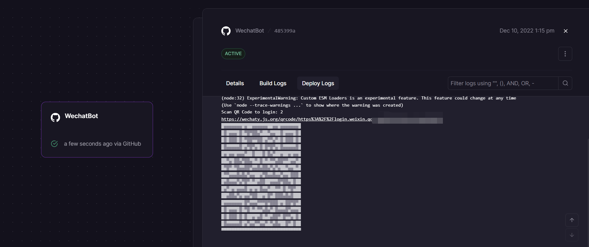

<h1 align="center">欢迎使用 wechat-chatgpt 👋</h1>
<p>
  
  <a href="#" target="_blank">
    
  </a>
  <a href="https://twitter.com/fuergaosi" target="_blank">
    
  </a>
  <a href="https://discord.gg/8fXNrxwUJH" target="blank">
    
  </a>
</p>

> 在微信上迅速接入 ChatGPT，让它成为你最好的助手！  
> [English](README.md) | 中文文档

[](https://railway.app/new/template/BHJD6L?referralCode=FaJtD_)

如果你没有自己的服务器或者想体验快速部署，可使用 Railway 进行部署，参见 [Railway 部署](#railway-部署)。

### 2022.12.27 更新
目前, 使用 Docker 或 Railway 部署, 会出现意料之外的问题, 我们正在努力解决。

### 2022.12.20 更新

感谢 @transitive-bullshit 的工作, 使得ChatGPT API可以自动完成这项工作。
现在可以使用密码的用户名来登录, 并配置打码 [CAPTCHAs](#CAPTCHAS) 来使得整个流程全自动化.


## 🌟 功能点

- [x] 通过 wechaty，将 ChatGPT 接入微信
- [x] 创建 OpenAI 的账户池
- [x] 支持通过代理登陆 OpenAI
- [x] 加入了持续对话的功能
- [x] 加入 Dockerfile
- [x] 发布到 Docker.hub
- [x] 通过 Railway 进行部署
- [x] 实现 OpenAI 账户池的热加载
- [X] 当 OpenAI 返回码为 429/503 时自动重试

## 在Linux上通过Docker使用（✅ 推荐）

```sh
cp config.yaml.example config.yaml
# 在当前目录创建并修改config.yaml
# 在Linux或WindowsPowerShell上运行如下命令
docker run -d --name wechat-chatgpt -v $(pwd)/config.yaml:/app/config.yaml holegots/wechat-chatgpt:latest
# 使用二维码登陆
docker logs -f wechat-chatgpt
```

## 在Windows上通过Docker使用

```sh
# 在当前目录创建并修改config.yaml
# 在WindowsPowerShell中运行如下命令
docker run -d --name wechat-chatgpt -v $(pwd)/config.yaml:/app/config.yaml holegots/wechat-chatgpt:latest
# 在Windows command line (cmd)中, 您需要像这样修改上述代码的挂载目录:
docker run -d --name wechat-chatgpt -v %cd%/config.yaml:/app/config.yaml holegots/wechat-chatgpt:latest
# 通过二维码登录
docker logs -f wechat-chatgpt
```

## 更新Docker镜像版本

```sh
docker pull holegots/wechat-chatgpt:latest
docker stop wechat-chatgpt
docker rm wechat-chatgpt
# 在Linux或WindowsPowerShell上运行如下命令
docker run -d --name wechat-chatgpt -v $(pwd)/config.yaml:/app/config.yaml holegots/wechat-chatgpt:latest
# 在Windows command line (cmd)中, 您需要像这样修改上述代码的挂载目录:
docker run -d --name wechat-chatgpt -v %cd%/config.yaml:/app/config.yaml holegots/wechat-chatgpt:latest
# 通过二维码登录
docker logs -f wechat-chatgpt
```

## 安装

```sh
npm install
```
> 请确认安装的NodeJS版本为18.0.0以上

## 配置

### 复制配置文件

将配置文件复制一份以配置您的项目

```sh
cp config.yaml.example config.yaml
```

### 获取 OpenAI 的账户并配置到项目中

> 如果你没有 OpenAI 的账号，并且您在无法访问 OpenAI 的国家或地区，你可以查看[here](https://mirror.xyz/boxchen.eth/9O9CSqyKDj4BKUIil7NC1Sa1LJM-3hsPqaeW_QjfFBc).

#### 配置方法 A：使用账号密码

可以在配置文件中输入你的账号密码，格式如下

```yaml
chatGPTAccountPool:
  - email: <your email>
    password: <your password>
# 如果你希望只有一些关键字可以在私人聊天中触发chatgpt，你可以这样设置:
chatPrivateTiggerKeyword: ""
```

⚠️ 触发关键字必须出现在接收到的消息的第一个位置⚠️

请确保您的终端网络可以登陆 OpenAI。如果登陆失败，请尝试使用代理或使用 SessionToken 方法配置

**设置代理:**
编辑配置文件 `config.yaml`
```yaml
openAIProxy: <代理地址>
```

### CAPTCHAS
> 该版本使用Puppeteer来尽可能的实现全自动化, 包括验证码 🔥
> Cloudflare CAPTCHAs是默认处理的, 但如果你想自动处理 邮箱+密码 的Recaptchas, 则需要使用付费的打码平台
> - [nopecha](https://nopecha.com/) - Uses AI to solve CAPTCHAS
    >   - Faster and cheaper
    >   - Set the `NOPECHA_KEY` env var to your nopecha API key
>   - [Demo video](https://user-images.githubusercontent.com/552829/208235991-de4890f2-e7ba-4b42-bf55-4fcd792d4b19.mp4) of nopecha solving the login Recaptcha (41 seconds)
> - [2captcha](https://2captcha.com) - Uses real people to solve CAPTCHAS
    >   - More well-known solution that's been around longer
    >   - Set the `CAPTCHA_TOKEN` env var to your 2captcha API token

如果你需要实现全自动化, 则需要配置`NOPECHA_KEY`或`CAPTCHA_TOKEN`。

### 启动项目

```sh
npm run dev
```

如果您是初次登陆，那么需要扫描二维码

## 使用 Railway 部署

[Railway](https://railway.app/) 是一个部署平台，您可以在其上配置基础架构，在本地使用该基础架构进行开发，然后将其部署到云端。本部分将描述如何快速使用 Railway 部署一个 wechat-chatgpt 项目。

首先，您需要注册一个 Railway 帐户，并使用 GitHub 验证登录。

然后点击下面的一键部署按钮进行部署。

[](https://railway.app/new/template/BHJD6L?referralCode=FaJtD_)

完成一些验证操作后，就可以开始部署了。您将看到以下界面：


您需要配置一些环境变量：

- **CHAT_GPT_EMAIL** ：您的 OpenAI 帐户电子邮件。

- **CHAT_GPT_PASSWORD** ：您的 OpenAI 帐户密码。

- **CHAT_GPT_RETRY_TIMES** ：当 OpenAI API 返回 429 或 503 时重试的次数。

- **CHAT_PRIVATE_TRIGGER_KEYWORD** ：如果您希望只有一些关键字才能在私人聊天中触发 ChatGPT，则可以设置它。

点击“部署”按钮，您的服务将立即开始部署。以下界面出现表示部署已经开始：


当部署过程显示为成功后，点击查看日志，在部署日志中找到微信登录链接：



点击链接，使用准备好的微信扫码登录。

成功登录并开始发送和接收消息（此过程可能需要几分钟）：


此外，在部署中，您可能会遇到以下问题：

- **Error: ⚠️ No chatgpt item in pool**：此错误表示验证信息有问题。您可以从以下几个方面解决此问题：1.检查 token 或 openAI 账号和密码是否正确填写。2. 重新部署当前服务。请注意，应在铁路仪表板的 **Variables** 页面上修改上述内容。 3. 请确认是否出现了CloudFlare人机验证, 如果出现了CloudFlare的人机验证, 则可能导致 Headless 浏览器无法成功模拟登录。
- **部署完成后，不会生成二维码**。尝试**刷新**页面，再次查看 Deploy Logs 面板是否生成了链接和二维码。
- **生成的二维码无法扫描**。在生成的二维码上，有一个链接可以点击扫描二维码。
- **消息反馈缓慢**。由于 Railway 的服务器部署在海外，消息反馈延迟会有所增加，但仍在可接受范围内。如果您对时间敏感，则可以使用自己的服务器部署。

## ✨ Contributor

<a href="https://github.com/fuergaosi233/wechat-chatgpt/graphs/contributors">
  
</a>

## 🤝 为项目添砖加瓦

欢迎提出 Contributions, issues 与 feature requests!<br />随时查看 [issues page](https://github.com/fuergaosi233/wechat-chatgpt/issues).

## 感谢支持 🙏

如果这个项目对你产生了一点的帮助，请为这个项目点上一颗 ⭐️
